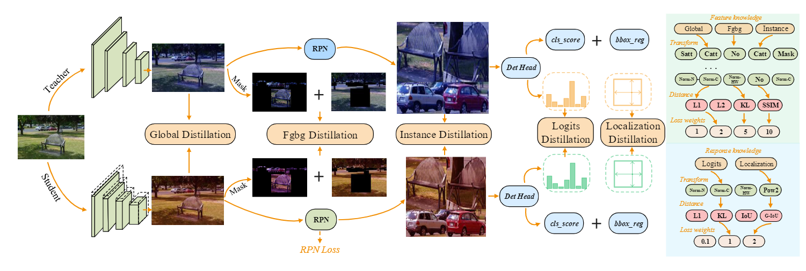

# [ICML2024] DetKDS: Knowledge Distillation Search for Object Detectors


## 

Official PyTorch implementation of DetKDS, accepted by ICML2024 

DetKDS: Knowledge Distillation Search for Object Detectors [PDF](https://openreview.net/pdf?id=SBR8Gwe1E2), [Supp](https://openreview.net/attachment?id=SBR8Gwe1E2&name=supplementary_material)

Lujun Li, Yufan Bao, Peijie Dong, Chuanguang Yang, Anggeng Li, Wenhan Luo, Qifeng Liu, Wei Xue, Yike Guo

HKUST, HKUST(GZ), ICT-CAS

See Results (see Folders /results) and model checkpoints (currently being uploaded on Baidu Cloud.)


## Introduction 

In this paper, we present DetKDS, the first framework that searches for optimal detection distillation policies. Manual design of detection distillers becomes challenging and time-consuming due to significant disparities in distillation behaviors between detectors with different backbones, paradigms, and label assignments. To tackle these challenges, we leverage search algorithms to discover optimal distillers for homogeneous and heterogeneous student-teacher pairs. Firstly, our search space encompasses global features, foreground-background features, instance features, logits response, and localization response as inputs. Then, we construct omni-directional cascaded transformations and obtain the distiller by selecting the advanced distance function and common weight value options. Finally, we present a divide-and-conquer evolutionary algorithm to handle the explosion of the search space. In this strategy, we first evolve the best distiller formulations of individual knowledge inputs and then optimize the combined weights of these multiple distillation losses. DetKDS automates the distillation process without requiring expert design or additional tuning, effectively reducing the teacher-student gap in various scenarios. Based on the analysis of our search results, we provide valuable guidance that contributes to detection distillation designs. Comprehensive experiments on different detectors demonstrate that DetKDS outperforms state-of-the-art methods in detection and instance segmentation tasks. For instance, DetKDS achieves significant gains than baseline detectors: +3.7, +4.1, +4.0, +3.7, and +3.5 AP on RetinaNet, Faster-RCNN, FCOS, RepPoints, and GFL, respectively.


## Setup

  - Our codes are based on [MMDetection](https://github.com/open-mmlab/mmdetection). Please follow the installation of MMDetection and make sure you can run it successfully.
  - This repo uses mmcv-full==1.3.17 and mmdet==2.19.0
  - If you want to use lower mmcv-full version, you may have to change the optimizer in apis/train.py and build_distiller in tools/train.py.

## Usage 

```

#single GPU Train
python tools/train.py configs/distillers/detkds/retina_rx101_64x4d_distill_retina_r50_fpn_2x_coco.py

#multi GPU Train
bash tools/dist_train.sh configs/distillers/detkds/retina_rx101_64x4d_distill_retina_r50_fpn_2x_coco.py 8

# Tansfer the MGD model into mmdet model
python pth_transfer.py --mgd_path $mmdet_ckpt --output_path $new_mmdet_ckpt

#single GPU Test
python tools/test.py configs/retinanet/retinanet_r50_fpn_2x_coco.py $new_mmdet_ckpt --eval bbox

#multi GPU Test
bash tools/dist_test.sh configs/retinanet/retinanet_r50_fpn_2x_coco.py $new_mmdet_ckpt 8 --eval bbox

```


## Acknowledgement

This repository is build upon the [MGD](https://github.com/yzd-v/MGD/tree/master), [PKD](https://github.com/open-mmlab/mmrazor/blob/main/mmrazor/models/losses/pkd_loss.py) and [MasKD](https://github.com/hunto/MasKD/tree/main/mmdetection) repository.


## Citation 

```
@inproceedings{lidetkds,
  title={DetKDS: Knowledge Distillation Search for Object Detectors},
  author={Li, Lujun and Bao, Yufan and Dong, Peijie and Yang, Chuanguang and Li, Anggeng and Luo, Wenhan and Liu, Qifeng and Xue, Wei and Guo, Yike},
  booktitle={Forty-first International Conference on Machine Learning},
  year={2024}
}
```
